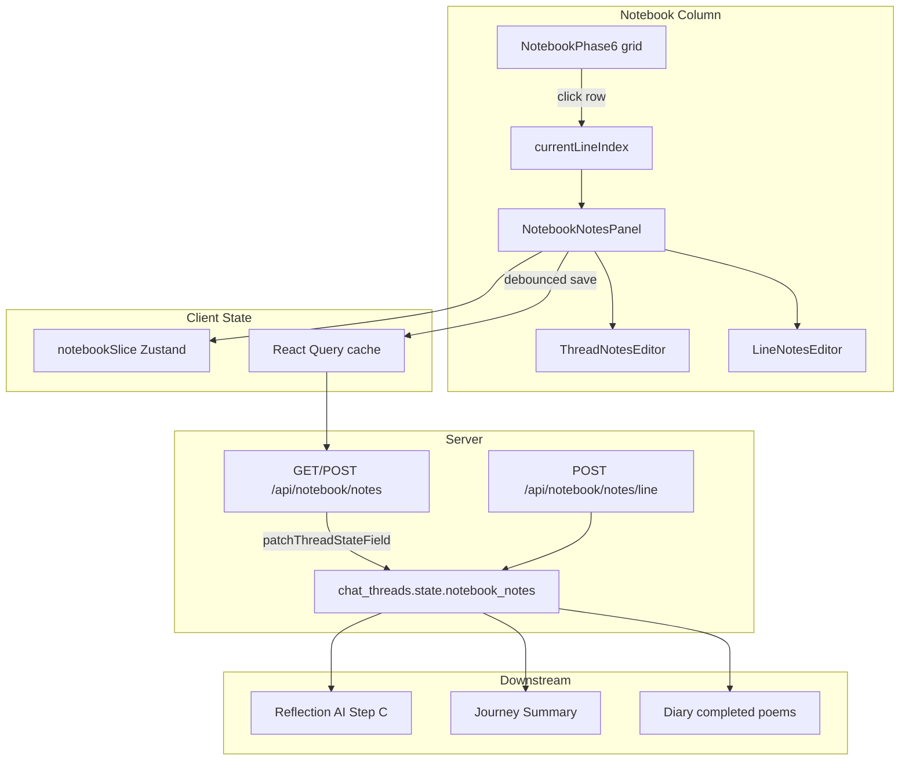

# Notebook Notes Feature — Current Implementation Reference

This document describes how the **Notes** feature works in the Translalia notebook section as implemented today. It is intended as LLM context for understanding UI behavior, data flow, persistence, and downstream use.

---

## 1. Purpose and scope

The notebook notes feature is a **translation diary** separate from the actual translation text. Users can write:

1. **General Reflection** — one free-form note about the whole translation journey (thread-level).
2. **Line Notes** — per-line annotations tied to poem line indices (0-based internally, displayed as 1-based).

These notes are **not** the same as:

- Translation draft/completed text in `workshopSlice` (`draftLines` / `completedLines`).
- Legacy `NotebookCell.notes[]` fields in `src/types/notebook.ts` (old cell-based model; **not used** by the current `NotebookPhase6` surface).
- **Context Notes** in the workshop rail (`ContextNotes` i18n namespace) — AI-generated educational hints about word options.

Notes are persisted server-side per thread and reused by reflection AI, journey summary, and the user diary.

---

## 2. Where it lives in the UI

### Page layout

The notebook is one column in the thread workspace (`ThreadPageClient.tsx`), rendered via:

```
NotebookViewContainer → NotebookPhase6 → NotebookNotesPanel (bottom)
```

`NotebookPhase6` is the main “real notebook” surface:

- **Top:** header with progress, save-all, full-editor entry
- **Middle:** two-column grid (Source | Translation), scrollable “notebook paper”
- **Bottom:** `NotebookNotesPanel` — collapsible notes drawer

The notes panel is **anchored to the bottom of the notebook column**, below the translation grid and any save-error banner, above modals like `FullTranslationEditor`.

### Visual structure of `NotebookNotesPanel`

The panel has two states:

#### Collapsed (default: `notesExpanded: false`)

A full-width clickable header bar:

- White background, top border (`border-t border-slate-200`)
- Left side: **“Notes”** title + optional status badges
- Right side: chevron (ChevronUp when collapsed, ChevronDown when expanded)
- Hover: light gray background
- Focus ring for keyboard accessibility

**Badges shown in the header (when applicable):**

| Badge | Condition | Appearance |
|-------|-----------|------------|
| Unsaved | Local edits not yet persisted | Amber text on amber-50 |
| Saving… | Save in flight | Spinner + “Saving…” |
| Saved | Successful save (shown ~2s) | Green check + “Saved” |
| `{N} line notes` | Any line notes exist | Outline badge with count |

#### Expanded

Animated expand/collapse via Framer Motion (`height: 0 → auto`, 300ms ease-out).

Inner area:

- Max height **400px**, scrollable
- Light gray background (`bg-slate-50/50`)
- Two sections stacked vertically

**Section A — General Reflection**

- Heading: “General Reflection”
- Optional **Clear** button (ghost, with X icon) when thread note has content — sets note to `null`
- `ThreadNotesEditor` textarea

**Section B — Line Notes**

- Heading: “Line Notes”
- **Save** button (outline, with Save icon) — only visible when a line is selected (`currentLineIndex !== null`); disabled when saving or no unsaved changes; label includes `(⌘↵)` shortcut hint
- **Current line editor** — shown when a line is selected
- **Empty state** — italic gray text: “Select a line in the notebook to add a note” when no line selected
- **Other Line Notes** — shown only when there are **more than one** line notes total; lists all line notes **except** the currently selected line, each with its own `LineNotesEditor`

While loading from API: centered spinner + “Loading notes…”

---

## 3. Editor components

### `ThreadNotesEditor`

- Auto-resizing textarea (min 3 lines, max 12 lines height before internal scroll)
- **Max length: 5000** characters
- Character counter bottom-right (always visible when maxLength set)
- Counter turns amber when >90% of limit
- Placeholder: “Write your reflections about the translation journey…”
- Uses local state synced from prop `value`; changes propagate immediately via `onChange`
- Empty string is stored as content (not auto-deleted on client for thread notes — Clear button explicitly sets `null`)

### `LineNotesEditor`

- Badge label: **“Line {number}”** where number = `lineIndex + 1`
- Auto-resizing textarea (min 2 lines, max 6 lines)
- **Max length: 1000** characters
- Character counter only shown when text length > 0
- Placeholder: “Add a note for this line…”
- Empty/whitespace-only input → `onChange(lineIndex, null)` which **removes** that key from `lineNotes`

Both editors use shadcn `Textarea`, blue focus ring, non-resizable by user (`resize-none`).

---

## 4. Line selection coupling

Line notes are keyed by **poem line index** from `workshopSlice.currentLineIndex`.

**How a line gets selected:**

- Clicking a source or translation row in `NotebookPhase6` calls `setCurrentLineIndex(idx)`
- Clicking/focusing a translation textarea also selects that line
- Workshop rail line selection (`selectLine`) also sets `currentLineIndex`
- Reflection rail can jump to a line via `setCurrentLineIndex`

**Visual feedback in notebook grid:**

- Selected row gets blue-tinted background (`rgb(239 246 255 / 0.5)`) and `notebook-row-selected` class
- Line number opacity increases on active row

The notes panel reads `currentLineIndex` to:

- Show/edit the note for that line in the primary editor
- Enable the manual Save button
- Filter “Other Line Notes” to exclude the current line

If `currentLineIndex === null`, users can still see the line-note **count** badge in the collapsed header, but cannot edit line notes until they select a line (unless they have 2+ line notes and can edit non-current ones in “Other Line Notes”).

---

## 5. State management

### Client store: `useNotebookStore` (`src/store/notebookSlice.ts`)

Notes-related fields:

```typescript
threadNote: string | null
lineNotes: Record<number, string>   // keys are line indices
notesExpanded: boolean              // panel open/closed
notesLastSaved: Date | null         // updated after successful save
```

Actions:

- `setThreadNote(note)`
- `setLineNote(lineIndex, note | null)` — deletes key when null/empty
- `toggleNotesPanel()` / `setNotesExpanded(expanded)`
- `setNotes(threadNote, lineNotes)` — bulk hydrate from API
- `updateNotesLastSaved()`

**Persistence in localStorage (via `threadStorage`):**

- Only UI prefs are persisted: `notesExpanded`, `showLineNumbers`, `fontSize`, `lastEditedLine`, `meta.threadId`
- **Note content is NOT stored locally** — always loaded from the database
- On thread switch (URL thread ID ≠ persisted thread ID), store resets to fresh defaults

### Server cache: React Query (`src/lib/hooks/useNotebookNotes.ts`)

| Hook | Purpose |
|------|---------|
| `useNotebookNotes()` | GET notes for current thread; query key `["notebook-notes", threadId]`; staleTime 30s |
| `useSaveNotebookNotes()` | POST full/partial notes; invalidates query on success |
| `useSaveLineNote()` | POST single line note — **defined but not used by any UI component today** |

Thread ID comes from `useThreadId()` (URL-derived).

### Load sequence in `NotebookNotesPanel`

1. `useNotebookNotes()` fetches from API
2. On first successful fetch (`isInitialLoad === true`), `setNotes()` hydrates Zustand
3. `isInitialLoad` flips to false — subsequent API refetches do **not** overwrite local edits
4. User edits set `hasUnsavedChanges = true`

---

## 6. Save behavior

### Auto-save (debounced)

- Trigger: any change to `threadNote` or `lineNotes` after initial load
- Debounce: **2.5 seconds**
- Calls `POST /api/notebook/notes` with full `{ threadNote, lineNotes }`
- Status flow: `idle → saving → saved → idle` (or `error → idle`)

### Manual save

- Save button in Line Notes section header
- Keyboard: **⌘↵** (Mac) / **Ctrl+Enter** (Windows/Linux) when panel is expanded
- Bypasses debounce; restores focus to previously focused element after save
- Escape collapses the panel

### Save status is local component state

Not persisted; purely UI feedback in the header badges.

---

## 7. API and database persistence

### Storage location

Notes live in Supabase `chat_threads.state` JSONB at path **`notebook_notes`**:

```typescript
{
  thread_note: string | null,
  line_notes: Record<number, string>,  // numeric keys in JSON
  updated_at: string | null            // ISO timestamp
}
```

### Endpoints

#### `GET /api/notebook/notes?threadId={uuid}`

- Auth required (`requireUser`)
- Ownership check: `thread.created_by === user.id`
- Returns camelCase: `{ threadNote, lineNotes, updatedAt }`
- Defaults if missing: `{ threadNote: null, lineNotes: {}, updatedAt: null }`

#### `POST /api/notebook/notes`

Body:

```json
{
  "threadId": "uuid",
  "threadNote": "optional string | null",
  "lineNotes": { "0": "note text", "3": "another note" }
}
```

- Merges `lineNotes` shallowly into existing `line_notes`
- Replaces `thread_note` only if provided in body
- Sets `updated_at` to now
- Writes via **`patchThreadStateField(threadId, ["notebook_notes"], updatedNotes)`** — atomic JSONB patch using Supabase `exec_sql` RPC (no read-modify-write clobber)

#### `POST /api/notebook/notes/line`

Body: `{ threadId, lineIndex: number, content: string | null }`

- Updates/deletes a single line note atomically
- Hook exists (`useSaveLineNote`) but **UI currently saves via bulk POST only**

---

## 8. Downstream consumers

Notes are treated as **student diary context** for AI and history features.

### `formatNotebookNotesForPrompt()` (`src/lib/ai/workshopPrompts.ts`)

Formats notes for LLM prompts as:

```
STUDENT'S TRANSLATION DIARY (NOTES):
GENERAL REFLECTION:
"{thread_note}"

LINE-SPECIFIC NOTES:
Line 1:
  Source: "..."
  Translation: "..."
  Student's Note: "..."
```

Used by:

- **`POST /api/reflection/ai-assist-step-c`** — Reflection rail “AI suggestions”
- **`POST /api/journey/generate-reflection`** — Journey summary generation

### Reflection rail (`ReflectionRail.tsx`)

- Reads `threadNote` / `lineNotes` from Zustand **and** fetches via `useNotebookNotes()`
- `hasNotes` boolean gates some UI (shows whether diary content exists)
- Sends only `threadId` to AI routes; server loads notes from DB

### Diary page (`/diary`)

- Completed poems RPC returns `notebook_notes`
- Expanded poem cards show thread note and per-line notes alongside translations
- `hasNotes` flag used for display logic

---

## 9. Internationalization

All user-facing strings use `useTranslations("Notebook")` with English defaults inline. Keys in `messages/en.json`:

| Key | Default EN text |
|-----|-----------------|
| `notesTitle` | Notes |
| `notesExpand` / `notesCollapse` | Expand notes / Collapse notes |
| `notesUnsaved` | Unsaved |
| `notesSaving` | Saving... |
| `notesSaved` | Saved |
| `notesLineCount` | line notes |
| `notesLoading` | Loading notes... |
| `notesThreadTitle` | General Reflection |
| `notesThreadPlaceholder` | Write your reflections about the translation journey... |
| `notesClear` | Clear |
| `notesLineTitle` | Line Notes |
| `notesSave` | Save |
| `notesSelectLine` | Select a line in the notebook to add a note |
| `notesOtherLines` | Other Line Notes |
| `notesLineLabel` | Line {number} |
| `notesLinePlaceholder` | Add a note for this line... |

Translated in all locale JSON files under `translalia-web/messages/`.

---

## 10. Key source files

| File | Role |
|------|------|
| `src/components/notebook/NotebookNotesPanel.tsx` | Main panel UI, save orchestration |
| `src/components/notebook/ThreadNotesEditor.tsx` | General reflection editor |
| `src/components/notebook/LineNotesEditor.tsx` | Per-line editor |
| `src/components/notebook/NotebookPhase6.tsx` | Notebook layout; mounts panel at bottom |
| `src/store/notebookSlice.ts` | Client notes state + panel expand persistence |
| `src/store/workshopSlice.ts` | `currentLineIndex` for line-note targeting |
| `src/lib/hooks/useNotebookNotes.ts` | React Query fetch/save hooks |
| `src/app/api/notebook/notes/route.ts` | GET/POST bulk notes |
| `src/app/api/notebook/notes/line/route.ts` | POST single line (unused by UI) |
| `src/server/guide/updateGuideState.ts` | `patchThreadStateField()` atomic writes |
| `src/lib/ai/workshopPrompts.ts` | `formatNotebookNotesForPrompt()` |

---

## 11. Architecture diagram



---

## 12. Behavioral edge cases and invariants

1. **Notes content is server-authoritative** — localStorage only remembers panel expanded/collapsed, not note text.
2. **Thread isolation** — switching threads resets notebook store defaults; notes reload from API for the new thread.
3. **Initial load guard** — API refetch after save invalidates React Query but does not clobber in-progress local edits (only first load hydrates store).
4. **Line note deletion** — clearing a line note removes its key from `line_notes` object (not stored as empty string).
5. **Thread note clearing** — explicit Clear button sets `threadNote` to `null` (distinct from empty string).
6. **“Other Line Notes” visibility** — requires `Object.keys(lineNotes).length > 1`; with exactly one line note, it only appears in the current-line editor when that line is selected.
7. **`useSaveLineNote` is dead code path from UI** — all saves go through bulk POST; line endpoint exists for potential granular updates.
8. **Line indices are 0-based in code**, 1-based in UI labels.
9. **Extra lines** beyond source poem length can be selected and noted same as regular lines (indices continue past `poemLines.length`).

---

## 13. What this feature does *not* do (today)

- No rich text / markdown formatting
- No note timestamps per line (only thread-level `updated_at` on the whole `notebook_notes` blob)
- No note search or filtering
- No inline note indicators on notebook rows (notes only visible in bottom panel)
- No offline queue beyond failed save error badge (no retry UI beyond auto-save on next edit)
- No integration with the tuning UI or workshop word-grid context notes
