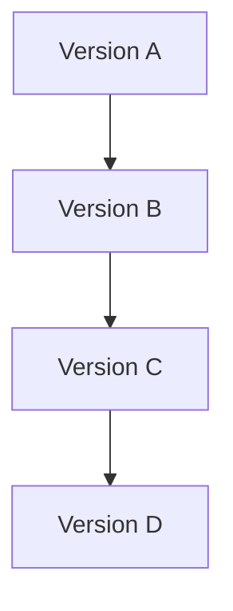
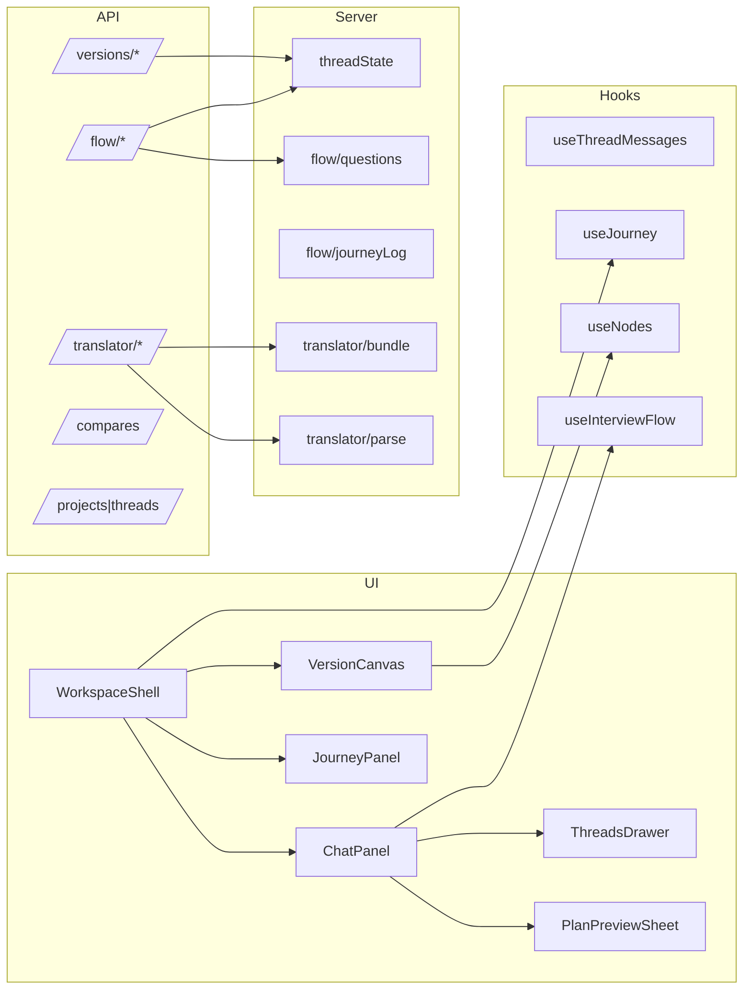

### [Last Updated: 2025-09-16]

## Relationships Map

### 1) Component → Component Imports

- `src/components/workspace/WorkspaceShell.tsx`
  - imports: `./chat/ChatPanel`, `./versions/VersionCanvas`, `./journey/JourneyPanel`, `./compare/CompareSheet`, `@/store/workspace`, `@/lib/supabaseClient`
- `src/components/workspace/chat/ChatPanel.tsx`
  - imports: `./ThreadsDrawer`, `../flow/PlanBuilderOverviewSheet`, `../translate/TranslatorPreview`, `@/store/workspace`, `@/hooks/useThreadMessages`, `@/hooks/useInterviewFlow`, `@/lib/supabaseClient`, `@/server/flow/intent`, `@/server/flow/softReplies`
- `src/components/workspace/chat/ThreadsDrawer.tsx`
  - imports: `@/lib/supabaseClient`, `@/store/workspace`, `@tanstack/react-query`
- `src/components/workspace/flow/PlanPreviewSheet.tsx`
  - used by: `ChatPanel`
- `src/components/workspace/translate/TranslatorPreview.tsx`
  - used by: `ChatPanel`
- `src/components/auth/AuthButton.tsx`
  - imports: `./AuthSheet`, `@/hooks/useSupabaseUser`, `@/hooks/useProfile`, `@/lib/supabaseClient`, `next/link`
- `src/components/auth/AuthNav.tsx`
  - imports: `next/link`, `next/navigation`, `@/lib/supabaseClient`, `@/hooks/useSupabaseUser`, `@/hooks/useProfile`
- `src/components/account/ProfileForm.tsx`
  - imports: `@/hooks/useSupabaseUser`, `@/hooks/useProfile`, `@/lib/supabaseClient`

### 2) Files → Services Dependencies

- Supabase (client):
  - `src/components/workspace/WorkspaceShell.tsx`, `src/components/workspace/chat/ThreadsDrawer.tsx`, `src/hooks/useThreadMessages.ts`, `src/hooks/useProfile.ts`, `src/components/auth/*`, `src/components/account/ProfileForm.tsx`, `src/app/(app)/workspaces/**/*.tsx`, `src/lib/authHelpers.ts`
- Supabase (server SSR):
  - `src/lib/supabaseServer.ts`, API routes that call it indirectly via `@/lib/apiGuard` or directly
- OpenAI SDK:
  - `src/lib/ai/openai.ts` (factory), used by `src/app/api/translator/preview/route.ts`
- Moderation:
  - `src/lib/ai/moderation.ts`, used by translator routes and accept-lines
- Rate limit & cache:
  - `src/lib/ai/ratelimit.ts`, `src/lib/ai/cache.ts`, used by translator preview
- Zod validation:
  - `src/lib/schemas.ts`, and inline in `src/app/api/flow/*`, `src/app/api/translator/*`, etc.
- React Query:
  - providers in `src/components/providers.tsx`, hooks in `src/hooks/*`, components (`ThreadsDrawer`, `ChatPanel`)
- Zustand:
  - `src/store/workspace.ts` consumed by many workspace components

### 3) UI → API Routes

- `ChatPanel.tsx`
  - `/api/chat/[threadId]/messages` (POST)
  - `/api/variants` (POST), then `/api/versions` (POST)
  - `/api/flow/start` (POST), `/api/flow/answer` (POST), `/api/flow/confirm` (POST)
  - `/api/flow/intent` (POST) [feature flagged]
  - `/api/translator/preview` (POST), `/api/translator/accept-lines` (POST), `/api/translator/instruct` (POST) [flagged]
- `ThreadsDrawer.tsx`
  - `/api/threads` (POST)
- `WorkspaceShell.tsx`
  - reads via Supabase client (no route calls) for `versions`, `journey_items`, `compares`
- `useInterviewFlow.ts`
  - `/api/flow/peek?threadId=...` (GET)
- `Projects/threads` pages
  - `/api/projects` (POST/DELETE), `/api/threads` (DELETE)

### 4) Database Tables → Accessing Functions/Files

- `profiles`
  - `src/hooks/useProfile.ts` (read/upsert), `src/components/auth/AuthSheet.tsx` (exists check, upsert), `src/lib/authHelpers.ts` (lookup by username)
- `projects`
  - `src/app/api/projects/route.ts` (insert/delete), `src/app/(app)/workspaces/page.tsx` (list)
- `chat_threads`
  - `src/app/api/threads/route.ts` (insert/delete), `src/app/api/flow/*/route.ts` (select for project), `src/server/threadState.ts` (select/update `state`), `src/components/workspace/chat/ThreadsDrawer.tsx` (list)
- `chat_messages`
  - `src/app/api/chat/[threadId]/messages/route.ts` (insert), `src/hooks/useThreadMessages.ts` (select)
- `versions`
  - `src/app/api/versions/route.ts` (insert), `src/app/api/versions/positions/route.ts` (upsert pos), `src/components/workspace/WorkspaceShell.tsx` (select)
- `compares`
  - `src/app/api/compares/route.ts` (insert), `src/components/workspace/WorkspaceShell.tsx` (select)
- `journey_items`
  - `src/server/flow/journeyLog.ts` (insert), `src/app/api/versions/route.ts` (insert), `src/app/api/compares/route.ts` (insert), `src/components/workspace/WorkspaceShell.tsx` (select)
- Storage `avatars`
  - `src/components/account/ProfileForm.tsx` (upload/getPublicUrl)
- RPC `accept_line`
  - `src/app/api/translator/accept-lines/route.ts`

### 5) Data Flow Diagram (Mermaid)

```mermaid
graph TD
  A[User] --> B[WorkspaceShell]
  B --> C[ChatPanel]
  B --> D[VersionCanvas]
  B --> E[JourneyPanel]
  C --> F[/api/flow/start]
  C --> G[/api/flow/answer]
  C --> H[/api/flow/confirm]
  C --> I[/api/chat/:threadId/messages]
  C --> J[/api/translator/preview]
  C --> K[/api/translator/accept-lines]
  C --> K2[/api/translator/instruct]
  C --> L[/api/variants]
  C --> M[/api/versions]
  B --> N{Supabase Client}
  N --> V[(versions)]
  N --> JI[(journey_items)]
  N --> CP[(compares)]
  I --> CM[(chat_messages)]
  F --> CT[(chat_threads)]
  G --> CT
  H --> CT
  J --> O{OpenAI}
  J --> P{Moderation}
  J --> Q[(Cache)]
  J --> RL[(Rate Limit)]
  K --> R[[RPC accept_line]]
  R --> CT
  subgraph DB[Supabase DB]
    CT
    CM
    V
    JI
    CP
  end
```

Notes:

- Most protected routes use `src/lib/apiGuard.ts` to require a Supabase session.
- Feature-flagged areas: translator preview/accept-lines, router, enhancer.
- Node listing API filters by `project_id` and `meta->>thread_id`.

### Versions Lineage (A → B → C → D)

- Lineage is defined in `versions.meta`:
  - `thread_id`: thread scope for nodes
  - `parent_version_id`: previous version id in the chain

Reads (nodes API uses thread-scoped filter):

```33:38:/Users/raaj/Documents/CS/Translalia/Translalia-web/src/app/api/versions/nodes/route.ts
.from("versions")
.select("id, tags, meta, created_at")
.eq("project_id", th.project_id)
.filter("meta->>thread_id", "eq", threadId)
```

Journey items are currently read by `meta->>thread_id`:

```59:66:/Users/raaj/Documents/CS/Translalia/Translalia-web/src/server/translator/bundle.ts
const { data: jrows } = await supabase
  .from("journey_items")
  .select("id, kind, summary, created_at, meta")
  .filter("meta->>thread_id", "eq", threadId)
  .order("created_at", { ascending: false })
  .limit(5);
```

> TODO-VERIFY: If a physical `thread_id` column is added to `journey_items`, switch to `.eq("thread_id", threadId)` (code has a comment noting this intent).

Mermaid (conceptual lineage):



---

### 6) Module Dependency Overview



### 7) Component Relationships & Data Flow

- Parent-child: `WorkspaceShell` → `ChatPanel`, `VersionCanvas`, `JourneyPanel`, `CompareSheet`
- Data paths:
  - `ChatPanel` → flow routes → `threadState` → UI prompts
  - `VersionCanvas` → `useNodes` → `/api/versions/nodes` → labels/overview
  - `JourneyPanel` → `useJourney` → `journey_items`

Shared state:

- `useWorkspace` store holds `projectId`, `threadId`, versions, compares, selection

### 8) Service Relationships

- OpenAI via `lib/ai/openai.ts` used by translator/enhancer routes
- Moderation wraps text pre/post LLM calls
- Cache and rate limiter used only by preview to date

Error propagation:

- API handlers map validation/moderation failures to 4xx; parse failures to 502; DB/RLS failures to 500

Initialization order:

- Middleware sets up Supabase session → route handlers call guards → server modules execute logic → responses shaped

### 9) Database Relationships (business context)

- `projects` own `chat_threads`, `versions`, `compares`, `journey_items`
- `chat_threads.state` stores the flow; accepts updates via `threadState` helpers
- `versions.meta` carries thread-scoped fields (`thread_id`, `display_label`, `parent_version_id`, `overview`, `status`)

Consistency:

- For preview/instruct, placeholder first, then update overview; UI tolerates eventual consistency via polling

Transactions:

- Individual inserts/updates are single-statement; RPCs encapsulate atomic accept-line writes

### 10) Relationship Patterns (LLM)

- Keep routes thin; move logic into `server/*` and reuse across handlers
- Prefer thread-scoped filters (e.g., `meta->>thread_id`) to avoid cross-thread leakage
- Validate inputs at boundaries; keep stores as projection layers only

### 11) Integration Guidelines

- Adding a new route: validate with Zod → `requireUser` (if writing) → call server modules → return typed JSON
- Adding a new component: fetch via hooks; write via API; update store minimally; avoid duplicating server state

### 12) Boundary Rules

- UI never mutates DB directly; all writes through routes
- Server modules avoid accessing browser-only APIs

### 13) Change Impact Analysis

- Changes in `threadState` shape affect: flow routes, enhancer/translator bundling, UI that snapshot state
- Changes in `versions.meta` affect: nodes API, canvas rendering, instruct/preview
- Adjusting rate limit/cache affects: user experience on preview and cost profile
