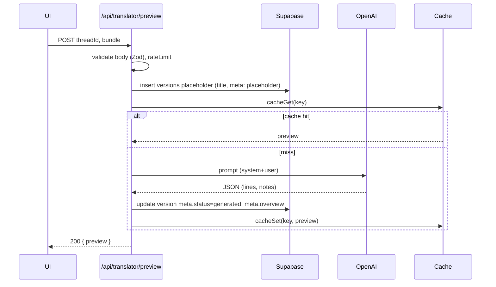
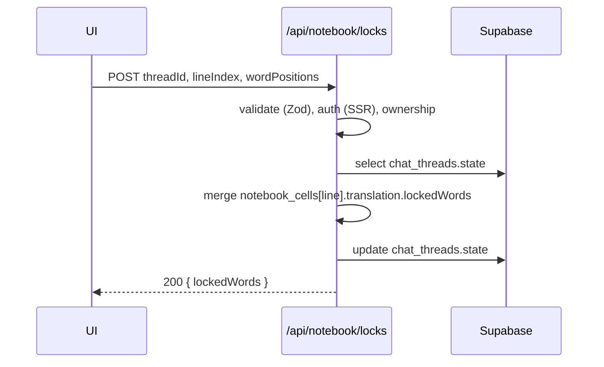
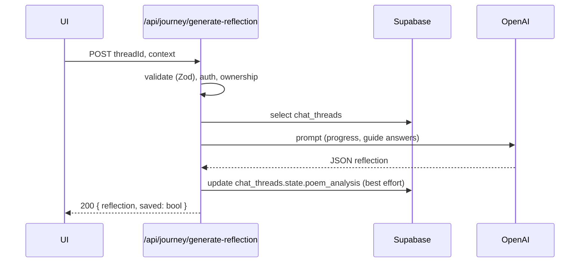

### [Last Updated: 2025-11-04]

## Domain: Data Flow

End-to-end: Interview → Plan → Preview → Accept → Canvas → Notebook

### Request lifecycle (client → server)
1) Client prepares request with SSR cookies (by default) and optionally `Authorization: Bearer <access_token>`
```19:33:/Users/raaj/Documents/CS/metamorphs/translalia-web/src/app/(app)/workspaces/[projectId]/page.tsx
const { data: sessionData } = await supabase.auth.getSession();
const accessToken = sessionData.session?.access_token;
const headers: HeadersInit = accessToken ? { Authorization: `Bearer ${accessToken}` } : {};
const res = await fetch(`/api/threads/list?projectId=${projectId}`, { cache: "no-store", credentials: "include", headers });
```
2) Middleware wires SSR cookies and enforces auth on protected paths; non‑authed redirected
```25:41:/Users/raaj/Documents/CS/metamorphs/translalia-web/middleware.ts
const needsAuth = pathname.startsWith("/workspaces") || pathname.startsWith("/api/threads") || pathname.startsWith("/api/flow") || pathname.startsWith("/api/versions");
if (needsAuth && !hasSupabaseCookies) { /* redirect to /auth/sign-in?redirect=... */ }
```
3) Route handler authenticates (cookie → Bearer), validates input (Zod), performs business logic, persists, and returns JSON
```12:22:/Users/raaj/Documents/CS/metamorphs/translalia-web/src/lib/apiGuard.ts
export async function requireUser(req: NextRequest): Promise<GuardOk | GuardFail> { /* cookie then bearer */ }
```
```8:15:/Users/raaj/Documents/CS/metamorphs/translalia-web/src/app/api/projects/route.ts
const parsed = createProjectSchema.safeParse(await req.json());
if (!parsed.success) return NextResponse.json({ error: parsed.error.flatten() }, { status: 400 });
```

### Data transformation at each layer
- Client: constructs fetch payloads, attaches Bearer; transforms UI selections into server payloads
```72:83:/Users/raaj/Documents/CS/metamorphs/translalia-web/src/app/(app)/workspaces/[projectId]/page.tsx
body: JSON.stringify({ projectId }),
```
- Server: parses/validates input → shapes DB rows → shapes response envelope
```95:141:/Users/raaj/Documents/CS/metamorphs/translalia-web/src/app/api/notebook/cells/route.ts
const workshopLine = workshopLines[index];
const translatedText = workshopLine?.translated || workshopLine?.text || "";
let status: NotebookCell["translation"]["status"] = "untranslated";
/* …build cells[] for response… */
```

### Validation points
- Zod schemas in handlers and server utilities
```12:18:/Users/raaj/Documents/CS/metamorphs/translalia-web/src/app/api/notebook/prismatic/route.ts
const BodySchema = z.object({ threadId: z.string().min(1), lineIndex: z.number().int().min(0), sourceText: z.string().min(1) });
```
- Query validation
```12:14:/Users/raaj/Documents/CS/metamorphs/translalia-web/src/app/api/notebook/cells/route.ts
const QuerySchema = z.object({ threadId: z.string().min(1, "threadId is required") });
```
- Ownership validation before heavy reads/writes
```21:35:/Users/raaj/Documents/CS/metamorphs/translalia-web/src/app/api/threads/list/route.ts
if (proj.owner_id !== user.id) return NextResponse.json({ ok: false, code: "FORBIDDEN_PROJECT" }, { status: 403 });
```

### Persistence mechanisms
- Supabase Postgres via SSR client or scoped bearer client
```51:61:/Users/raaj/Documents/CS/metamorphs/translalia-web/src/app/api/notebook/prismatic/route.ts
const supabase = createServerClient(/* url, anon, cookies */);
```
- Writes: `versions` insert/update, `chat_threads.state` JSONB updates, `journey_items` insert
```124:134:/Users/raaj/Documents/CS/metamorphs/translalia-web/src/app/api/translator/preview/route.ts
await sb.from("versions").insert({ project_id: projectId, title: displayLabel, lines: [], meta: placeholderMeta, tags: ["translation"] }).select("id").single();
```
```116:125:/Users/raaj/Documents/CS/metamorphs/translalia-web/src/server/guide/updateGuideState.ts
await supabase.from("chat_threads").update({ state: { ...currentState, guide_answers: mergedAnswers } }).eq("id", threadId);
```

### Cache interactions
- In‑memory TTL cache with stable key; checked before expensive LLM calls
```101:109:/Users/raaj/Documents/CS/metamorphs/translalia-web/src/app/api/notebook/ai-assist/route.ts
const cached = await cacheGet<AIAssistResponse>(cacheKey);
if (cached) { return NextResponse.json(cached); }
```
- Stored after computation
```241:244:/Users/raaj/Documents/CS/metamorphs/translalia-web/src/app/api/notebook/ai-assist/route.ts
await cacheSet(cacheKey, result, 3600);
return NextResponse.json(result);
```
- Rate limit guard before work
```3:16:/Users/raaj/Documents/CS/metamorphs/translalia-web/src/lib/ai/ratelimit.ts
export function rateLimit(key: string, limit = 30, windowMs = 60_000) { /* token bucket */ }
```

### Response generation
- JSON envelopes with `{ ok }` or `{ error: { code, message } }` patterns
```20:24:/Users/raaj/Documents/CS/metamorphs/translalia-web/src/app/api/notebook/prismatic/route.ts
function err(status: number, code: string, message: string, extra?: any) { return NextResponse.json({ error: { code, message, ...extra } }, { status }); }
```
- Partial success returns to avoid blocking the UI on secondary failures
```160:170:/Users/raaj/Documents/CS/metamorphs/translalia-web/src/app/api/guide/analyze-poem/route.ts
if (saveErr) { log("save_fail", saveErr.message); return ok({ analysis, saved: false }); }
```

### Error propagation
- Standard status mapping: 400/401/403/404/409/429/500/502
```8:15:/Users/raaj/Documents/CS/metamorphs/translalia-web/src/app/api/threads/list/route.ts
if (!projectId) { return NextResponse.json({ ok: false, code: "MISSING_PROJECT_ID" }, { status: 400 }); }
```
- LLM errors: parameter/model fallback then `502 OPENAI_FAIL` with concise envelope
```200:238:/Users/raaj/Documents/CS/metamorphs/translalia-web/src/app/api/notebook/prismatic/route.ts
if (shouldFallback) { /* switch to gpt-4o */ } else { return err(502, "OPENAI_FAIL", "Upstream prismatic generation failed.", { upstream: String(modelError?.message ?? modelError) }); }
```

### Sequence diagrams

#### A) Translator Preview (happy path)


#### B) Notebook Locks Update


#### C) Journey Reflection


### Notes
- All write routes use auth guards; ownership validated before reading heavy data.
- Cache and rate limit are applied to hot LLM endpoints.
- Error envelopes are consistent to simplify client handling.
